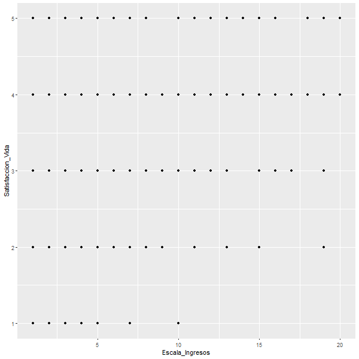

## La complacencia con la desigualdad a través de la clase social y el género  

Francisco Rodríguez - Diego Valenzuela  

```{r include = FALSE}
install.packages("citr",repos = "http://cran.us.r-project.org")
library(citr)
install.packages("ggplot2",repos = "http://cran.us.r-project.org")
library(ggplot2)
install.packages("stargazer",repos = "http://cran.us.r-project.org")
library(stargazer)
load("input/data/original/ELSOC_W01_v3.10_R.RData")
View(elsoc_2016)
data=elsoc_2016[,c("s01","m30","m0_sexo")]
names (data) = c("Satisfaccion_Vida", "Escala_Ingresos", "Género")
data[data=="-999"]<- NA
data[data=="-888"]<- NA
data<-na.omit(data)
```


#### Abstract  
La desigualdad ha sido una problemática presente en  el debate político y social en Chile desde el retorno a la democracia [@pnud_desiguales_2017], sin embargo las estrategias políticas de los gobiernos en la última década han estado enfocadas en la felicidad o bienestar subjetivo de la población, descuidando las condiciones objetivas en las que vive la población. En el presente ensayo se analiza -a partir de la encuesta ELSOC, del Centro de Estudios de Conflicto y Cohesión Social (COES)- la variación existente en la satisfacción con la vida de las y los chilenos (año 2016) a partir de dos variables: género y clase social. Se plantea en un inicio -a modo de hipótesis- que ambas variables inciden en la satisfacción con la vida de la población chilena, y que, además, tales indicadores se encuentran correlacionados entre sí. Finalmente, los resultados afirman la hipótesis de una relación positiva entre clase social y satisfacción con la vida, pero contradicen las demás suposiciones, pues se concluye que no existe una relación entre los indicadores utilizados (explanans), y que el género, no incide de manera significativa sobre la satisfacción subjetiva de las personas, por lo que, se observa con peligro el uso de la satisfacción subjetivo como índice de crecimiento y objetivo de las políticas de Estado, ya que no se relaciona directamente con las desigualdades existentes en el país como es la desigualdad de género.


Junio, 2019


### Problematizando la Satisfacción en la Desigualdad

La desigualdad ha sido una problemática presente en  el debate político y social en Chile desde el retorno a la democracia [@pnud_desiguales_2017]. Si bien a lo largo del tiempo se han logrado avances en planos institucionales, sociales o económicos, durante el último tiempo las políticas públicas han perdido influencia, ya que en los sectores populares y la clase media se observa una rigidez en cuanto a la movilidad social, además de que la distancia entre los sectores extremos se acrecenta [@espinoza_estratificacion_2013]. Si bien diversos estudios como el del Programa de las Naciones Unidas para el Desarrollo [@pnud_desiguales_2017] muestran que en Chile existen mejoras notables en los niveles de bienestar de su población, y la tasa de pobreza está muy debajo del promedio de América Latina, también observan una “herencia de la desigualdad” a través de mecanismos que la reproducen, los cuales están profundamente enraizados en la estructura del país [@pnud_desiguales_2017]. De esta forma se hace imprescindible buscar soluciones para disminuir y terminar con esta desigualdad que perjudica el desarrollo, el progreso económico, la legitimidad sistema político, las interacciones sociales y, por consecuencia, la cohesión social [@pnud_desiguales_2017]. 

Ahora bien, en la última década se ha observado un enfoque positivista en cuanto a destinación de políticas públicas por parte de los gobiernos de turno,en el sentido de poner la atención en la “felicidad” subjetiva de los individuos más que en las condiciones objetivas de desigualdad. Esto se enmarca en una tendencia global a valorar la subjetividad y el bienestar de los individuos. Respecto a esto podemos observar la resolución 55/309 de Naciones Unidas el 19 de Julio de 2011, donde se propone a las naciones emprender medidas y políticas para la búsqueda de la felicidad y el bienestar de las personas, así como el desarrollo del “Índice para una Vida Mejor”, que son una serie de medidas que deben cumplir las naciones miembros la OCDE [@farias_olavarria_subjective_2015]. En el caso de Chile podemos observar la solicitud que realiza el gobierno al PNUD el año 2012 para la realización de un estudio sobre el bienestar subjetivo en Chile, y la incorporación de la pregunta sobre la satisfacción con la vida en la encuesta CASEN desde 2011 [@farias_olavarria_subjective_2015]. 

Utilizar esta medida como una escala sobre la situación global del país (sí la gente está satisfecha con su vida, el país funciona correctamente) puede ser peligroso. El artículo de Jiménez y Pérez-Tello (2012) nos da cuenta del riesgo que existe en “celebrar” la felicidad en la pobreza o el bienestar en la vulnerabilidad. Esto puede llevar a la creencia de que no teniendo los mismos accesos a derechos podemos ser igualmente felices, o tener una visión ultra positiva de la vida. Es por esto que el hecho de que las políticas públicas estén enfocadas en la felicidad y satisfacción subjetiva puede ser pensado como un desplazamiento de los conflictos desde el espacio político y social hacia el espacio de la intimidad (Jiménez; Pérez-Tello, 2012) , lo que podría traer consecuencias como que la gente sienta bienestar en la desigualdad. 

### Desde la Sociología

Es Pierre Bourdieu quien nos entrega un concepto clave que podría explicar esta problemática: el habitus. Para este autor, los habitus son esquemas que funcionan más allá de la conciencia y el discurso, fuera de las influencias del control voluntario, orientando las prácticas, y ofreciendo los principios fundamentales de la construcción y la evaluación del mundo. [@bourdieu_distincion_2006] .De esta forma el gusto aparece como el sentido de la orientación social, o, en otras palabras, orienta a los ocupantes de una determinada clase  en el espacio social, hacia las posiciones sociales ajustadas a sus propiedades, prácticas o bienes que convienen a los individuos de esa posición. Podemos entonces discutir si la satisfacción con la vida que pueden manifestar individuos de distintas clases (sociales, sexuales) se deben al habitus con el que cuentan, lo que ayudaría a reproducir las estructuras sociales, económicas y culturales en las que se encuentran, y con ello, la desigualdad. Como ya se dijo, estas disposiciones para conocer el mundo social están incorporadas, formando esquemas clasificadores, de percepción y apreciación, siendo estas productos de las clases, en un sentido clasificatorio (clases de edad, clases sociales, clases sexuales). Es por eso que este trabajo busca explicar la satisfacción subjetiva con la vida de las personas, a través de la clase social y la clase sexual.
Por otro lado, estudios sobre la satisfacción subjetiva demuestran que en Chile, ha sido la psicología (68,8%) la disciplina que contribuye mayoritariamente al desarrollo de este campo, seguido por la economía (12,5%). [@farias_olavarria_subjective_2015]. Por lo tanto, observar esta problemática desde una perspectiva sociológica es imprescindible para analizar y dar explicaciones sobre el bienestar subjetivo, la felicidad, o la satisfacción con la vida de la población en un contexto social e histórico determinado que influye sobre una sociedad chilena completamente desigual. En este sentido, observar las variables que afectan el bienestar subjetivo, no  como un índice que debe ser aumentado, sino como un fenómeno social que provoca o reproduce desigualdades estructurales en la sociedad chilena.

### Satisfacción o Bienestar Subjetivo

Según @veenhoven_estudio_nodate, la temática de la satisfacción con la vida se empieza a tratar en los años 60, en ese entonces “se introdujo el término “calidad de vida”. Inicialmente el concepto era polémico. Sirvió para denotar que hay algo más que simplemente bienestar material.” [@veenhoven_estudio_nodate]. Así, “al igual que los indicadores económicos que guían la política económica, debían existir indicadores sociales que guiaran la política social.” [@veenhoven_estudio_nodate]. Este autor -considerado pionero en los estudios de la felicidad, en el sentido del disfrute subjetivo-, da su definición del concepto de satisfacción con la vida: 
La satisfacción con la vida es el grado en que una persona evalúa la calidad global de su vida en conjunto de forma positiva. En otras palabras, cuánto le gusta a una persona la vida que lleva. [@veenhoven_estudio_nodate] Por lo tanto, la satisfacción con la vida -desde Veenhoven- refiere a una valoración, lo cual puede ser muy aplicable a estudios a través de encuestas, puesto que bajo esta concepción, la valoración que las personas explícitamente dan de su vida es reflejo de su satisfacción real. Sin embargo, este concepto es planteado en 1994, y por un sociólogo, es necesaria una intromisión en otras disciplinas, sobre todo la psicología, para realizar una descripción satisfactoria de la trayectoria de esta temática. 
Desde la psicología, por lo tanto, un modelo importante es la teoría homeostática del bienestar, planteada por Cummins, Eckersley, Pallant, Misajon, Davern, Van Vugt y Cols entre el 2000 y 2002 aproximadamente, con respecto a ella, Watanabe (2005) indica: 
Esta teoría señala que el bienestar subjetivo opera en un nivel abstracto no específico, que puede ser medido ―para el caso de la satisfacción― a través de la pregunta “¿Qué tan satisfecho está usted con su vida como un todo?”. A pesar de la generalidad de la pregunta, la respuesta que la gente da refleja su estado general de bienestar subjetivo, el cual es el nivel en el que el sistema homeostático trabaja como una consecuencia de la adaptación. (p. 122). Este sistema homeostático -del cual se puede medir su nivel de adaptación a partir de la misma pregunta validada por Veenhoven-, “tiene el rol de crear un sentido positivo de bienestar que es no específico y sí altamente personalizado, y que concierne sólo al bienestar percibido del individuo que está haciendo la valoración y únicamente en el sentido más general” (Watanabe, 2005, p. 122), esto pues, el bienestar subjetivo desde esta teoría se encuentra en un constante ajuste con el funcionamiento humano, proceso a la vez, mediado por el medio ambiente y los recursos mentales del individuo. 


Debido a esto, es que la pregunta por la satisfacción con la vida puesta en el cuestionario de la encuesta ELSOC, se corresponde con las mediciones propuestas tanto por Veenhoven como por la teoría homeostática del bienestar (esto se puede ver más adelante en la descripción de la variable “satisfacción con la vida”).

### Sobre la Clase Social y el Género

Son variados los estudios que abordan la satisfacción o bienestar subjetivo a través de la clase social y el género. Con respecto a la clase social, se utilizará a través de la variable ingresos líquidos por tramos. La mayoría de los estudios coinciden en una asociación estadística entre el bienestar subjetivo y la clase social. [@navarro-carrillo_clase_2018; @victoria_garcia-viniegras_categoria_2000]. Por otro lado, en los estudios sobre género existe mayor variación respecto a los resultados. @javaloy_estudios_nodate muestra que los hombres poseen un mayor bienestar subjetivo que las mujeres, siendo esta diferencia muy pequeña, mientras que otros investigadores sostienen que las diferencias en estilos de personalidad entre hombres y mujeres no influyen en su bienestar subjetivo [@garcia_felicidad_2002]. Por esta razón, resulta importante profundizar en esta perspectiva y analizar el bienestar subjetivo en función de cambios socio-cognitivos como lo son las expectativas de roles de género [@navarro-carrillo_clase_2018] especialmente en el contexto chileno, donde estas relaciones  han estado en el centro de muchos debates sociales y políticos.

### Objetivos

- Objetivo Principal: Describir y analizar la variación de la satisfacción con la vida en función de las clases sociales y el género en la población chilena 

#### Objetivos Específicos:

1. Describir y analizar el efecto de la pertenencia a clases sociales en la satisfacción con la vida de la población chilena
2. Describir y analizar el efecto del género en la satisfacción con la vida de la población chilena.
3. Describir y analizar a través de un modelo estadístico el efecto de la clase social junto al género en la satisfacción con la vida de la población chilena.

### Hipótesis

En función de nuestros objetivos, las hipótesis que se desprenden son:

1. Las personas de clases sociales bajas, comparadas con las de clases más altas, viven en ambientes sociales con menos recursos materiales y, por tanto, más vulnerables, amenazantes e imprevisibles [@kraus_social_2012], por lo que su satisfacción con la vida es menor. Se observaría una relación positiva entre clase social (de baja a alta) y satisfacción con la vida. 

2. La desigualdad de género  afecta principalmente a las mujeres, a través de discriminación social, ingresos más bajos, etc. [@pnud_desiguales_2017], por lo que se observaría una baja en la satisfacción de las mujeres en cuanto a hombres.

3. Considerando la “discriminación salarial por género en Chile” [@fuentes_discriminacion_2005], se plantea que los dos predictores de este estudio (género e ingreso) están correlacionados en cuanto a la explicación de la satisfacción subjetiva.


# Metodología:

Los datos de este estudio, son extraídos de la encuesta ELSOC, del Centro de Estudios de Conflicto y Cohesión Social (COES), pues ésta contiene los datos necesarios para la descripción y correlación de las variables satisfacción con la vida, clase social, y género, presentes en el Chile de 2017.  Este es un cuestionario compuesto por preguntas de carácter simple y múltiple, además de algunas preguntas abiertas. El diseño muestral es probabilístico, estratificado, por conglomerados y multietápico. En tanto, el universo muestral de esta encuesta: 
“proporciona una cobertura adecuada de las ciudades más grandes del país (Gran Santiago, Gran Valparaíso y Gran Concepción), así como ciudades más pequeñas, y también asegura la representación de personas en el norte y sur del país. En términos globales, el diseño muestral alcanza una representatividad aproximada del 77 % de la población total del país, y del 93% de la población urbana.” (COES, 2017) 
Se puede ver, que los datos corresponden mayoritariamente a zonas urbanas del país, que a zonas rurales, por lo cual no es un muestreo totalmente aleatorio, ni representa de igual manera a todos los grupos sociales. El número de casos, en tanto, es de 3025 encuestados, y 2984 individuos en la base de datos definitiva, por ello, corresponde a una muestra representativa de la población de los sectores estudiados.

Las variables a analizar, son género y clase social como variables predictoras independientes, y satisfacción con la vida como la variable dependiente. En la encuesta, la variable género corresponde a una variable categórica dicotómica: hombre y mujer, siendo 1=hombre y 2=mujer. La variable clase social es representada a partir de la variable ingresos líquidos del hogar de las personas por tramos, por lo tanto es una intervalar. Esta variable cuenta con 20 categorías (Menos de $220.000 / De $220.001 a $280.000 / De $280.001 a $330.000 / De $330.001 a $380.000 / De $380.001 a $420.000 / De $420.001 a $470.000 / De $470.001 a $510.000 / De $510.001 a $560.000 / De $560.001 a $610.000 /De $610.001 a $670.000 / De $670.001 a $730.000 / De $730.0001 a $800.000 / De $800.001 a $890.000 / De $890.001 a $980.000 / De $980.001 a $1.100.000 / De $1.100.001 a $1.260.000 /  De $1.600.001 a $1.490.000  / De $1.490.001 a $1.850.000 / De $1.850.001 a $2.700.000 / Más de $2.700.000). Esta variable fue operacionalizada del 1 al  20, siendo 1 Menos de $220.000 y 20 Más de $2.700.000.  Por último la variable satisfacción con la vida, es una variable ordinal que está operacionalizada como una escala de cinco opciones: Totalmente insatisfecho, Insatisfecho, Ni insatisfecho ni satisfecho, Satisfecho, Totalmente satisfecho. Esta escala fue operacionalizada del 1 al 5, siendo el 1 Totalmente Insatisfecho, y el 5, Totalmente Satisfecho.

Los métodos de análisis de datos, son primeramente un análisis univariado de la relación entre género y satisfacción con la vida, luego otro entre clase social y satisfacción con la vida y finalmente una regresión múltiple, en la cual -como se indica anteriormente- las variables independientes son clase social y género, y la dependiente satisfacción con la vida, analizando de ésta manera como inciden los predictores en el explanandum, y si estos predictores tienen alguna relación entre sí (esto se extrae de la variación de sus coeficientes de regresión entre sus correlaciones simples y múltiples), aunque se puede intuir que no la hay, de todas formas se comprueba para expeler dudas. Los resultados de esta regresión se expresan en gráficos, tales como scatters (para ver las formas de dispersión) y tablas de correlación. 

**Descriptivos Básicos**

*Variable Sexo:  	Hombre   Mujer 
 	                1190    1793 

*Variable Satisfacción con la Vida:


Totalmente insatisfecho    Insatisfecho     Ni satisfecho ni insatisfecho   Satisfecho
          71 		               270			               456			                1788

Totalmente satisfecho 
         388 


*Variable Ingreso Mensual Líquido por Tramos:

Menos de $220.000= 1, De $220.001 a $280.000= 2, De $280.001 a $330.000= 3, De $330.001 a $380.000= 4, De $380.001 a $420.000= 5, De $420.001 a $470.000= 6, De $470.001 a $510.000 = 7, De $510.001 a $560.000= 8, De $560.001 a $610.000= 9, De $610.001 a $670.000= 10, De $670.001 a $730.000= 11, De $730.0001 a $800.000= 12, De $800.001 a $890.000= 13,    De $890.001 a $980.000=14, De $980.001 a $1.100.000= 15, De $1.100.001 a $1.260.000= 16, De $1.600.001 a $1.490.000= 17, De $1.490.001 a $1.850.000= 18,  De $1.850.001 a $2.700.000= 19, Más de $2.700.000= 20

**Tabla Estadísticos Básicos Variables:**
```{r, echo=FALSE}
stargazer(data, type = "text", digits=1)
```


Elaboración Propia a partir de Base de Datos ELSOC 2016

Esta tabla nos muestra los estadísticos básicos de las variables a utilizar. Como podemos observar, el número de casos es 442, pues de los iniciales 2984 en la base de datos, solo 442 personas respondieron a las tres variables analizadas en este ensayo.. Sobre la variable sexo, podemos observar que su promedio es 1.6, lo que significa que existe un mayor número de mujeres que de hombres encuestados (siendo 1=hombres y 2=mujeres), lo cual corroboramos en la información anterior. Sobre la escala de ingresos, que va desde el 1 (menor ingreso, asociado a menor clase social) hasta el 20 (ingresos más altos, asociados a clase social alta), vemos que el promedio es 7,5, por lo que podemos decir que el promedio de ingreso del hogar de todos los encuestados es cercano al intervalo $560.000 - $610.000…  Por otro lado, si observamos la variable de satisfacción con la vida, siendo 1 Totalmente Insatisfecho y 5 Totalmente satisfecho, vemos que su promedio es 3,7, por lo que podemos observar que el promedio de satisfacción con la vida de los encuestados es cercano a la opción no estar insatisfecho ni satisfecho.

## Diagnóstico de supuestos para la regresión

En este apartado se analizarán los supuestos que deben cumplir las variables para la realización de una regresión.

*Linealidad


**Tabla Test Anova para Linealidad**

Model 1: Satisfacción_Vida ~ Escala_Ingresos + Sexo
Model 2: Satisfacción_Vida ~ Escala_Ingresos + Sexo + I(.fitted^2)
 
Res.Df°	RSS Df Sum of Sq  	F Pr(>F)
 
1	472 336.02                 	      
2	471 335.25  1   0.77593 1.0901  0.297

En el gráfico, podemos observar que los puntos no están distribuidos de una forma aleatoria, sino más bien, relativamente ordenados. Ahora bien, el intervalo de confianza de la curva ajustada está solapado con la línea residual = 0, y, si observamos la tabla del test anova, nos encontramos con que la diferencia no es significativa, por lo que el predictor agregado no provoca diferencia en la estimación, y por lo tanto, no existiría evidencia de relación entre residuos y valores predichos. Así, observamos que se cumple este supuesto.


## Homocedasticidad:

**Test Estadísticos**

Non-constant Variance Score Test
Variance formula: ~ fitted.values
Chisquare = 31.43034, Df = 1, p = 2.0673e-08

data:  reg3
BP = 20.182, df = 2, p-value = 4.146e-05
 
Como podemos observar, los valores de los estadísticos son 0,00069 (Cook.Weisberg) y 0,028 (Breusch-Pagan), por lo que no se puede rechazar la hipótesis nula de que la varianza de los errores es constante, por lo tanto, se puede concluir que se cumple el supuesto de homocedasticidad.

## Observaciones Influyentes


Luego de calcular el punto de corte (D de Cook) que nos dió 0,08, podemos observar este gráfico, en el que no existen observaciones influyentes, o que puedan marcar una tendencia sesgada en la muestra, por lo que podemos afirmar que el supuesto de observaciones influyentes se  acepta, y es posible aplicar la regresión.


## Normalidad

**Test Shapiro Wilk**

data:  Base_Final2$.resid

W = 0.92526, p-value = 1.245e-14 (0,002566004)


Se muestra la comparación de los cuantiles empíricos de los residuos stunderizados del modelo de regresión (casos), contra los cuantiles teóricos de una distribución tt o normal (representada por la línea azul). Esto nos demuestra que los residuos están distribuidos de una forma relativamente normal. Por otro lado, el test de Shapiro Wilk nos muestra que la hipótesis nula de normalidad es rechazada al ser valor p menor a 0,05. Por lo tanto, el supuesto de normalidad se acepta y es posible realizar el modelo de regresión.

# Resultados

## Análisis Bivariado
   
**Gráfico de Correlación entre Satisfacción con la Vida y Clase Social**




Elaboración Propia a partir de Base de Datos ELSOC 2016


Se puede ver que nuestra hipótesis alternativa de correlación positiva entre nivel económico y satisfacción con la vida se cumple, a medida que aumenta en nivel de ingresos, también tiende a hacerlo la satisfacción con la vida, sin embargo hay algunos valores que se alejan bastante de la estimación (residuos).


No se observa una correlación significativa entre el género y la satisfacción con la vida, esto contradice nuestra hipótesis alternativa de que sí la hay, puesto que no se visualiza una variación significativa de la satisfacción con la vida por influencia del género del o la encuestada. 


## Análisis Multivariado 


En términos generales, se visualiza una regresión positiva entre la variable nivel de ingresos y la satisfacción con la vida, esta correlación es estadísticamente significativa con un 99% de confianza, pues su coeficiente beta indica que a medida que el ingreso avanza en un punto, el valor estimado de la satisfacción con la vida aumenta en 0,045, valor considerable si se toma en cuenta que la variable nivel de ingresos (por tramos) posee muchos niveles. 
Distinto es el caso de la correlación entre la variable sexo y satisfacción con la vida, puesto que bajo ningún nivel de confianza se puede afirmar que se puede explicar el nivel de satisfacción con la vida de las personas a partir de su sexo, y, a su vez, su coeficiente beta, -integrando ingresos al modelo y con satisfacción con la vida como variable dependiente- es de 0,048, índice muy bajo si se toma en cuenta que esta variable posee tan solo dos valores.
A su vez, no se puede concluir que existe correlación entre predictores, pues el coeficiente beta significativo (el de la variable clase social) no varía con la integración de la variable sexo al modelo (controlando por la variable sexo, el beta de clase social se mantiene constante). En tanto, a pesar de que la variable sexo si experimenta una variación al ser integrada al modelo tres, de todas formas su coeficiente beta no es significativo en ninguno de los modelos en que participa, por lo cual, a pesar de ser una idea contraintuitiva, no se puede afirmar que existe una correlación entre ingreso y sexo. El hecho de que no sea significativo el coeficiente beta de la variable sexo en ninguno de los modelos, se debe a que la variación experimentada entre los promedios estimados de satisfacción con la vida de las mujeres no son muy diferentes a los de los hombres en relación con su desviación estándar.
Finalmente, el valor del R2 estandarizado, nos indica que la pendiente de la variación de la satisfacción con la vida según los ingresos del hogar de los encuestados, es de 0,067, esto quiere decir que un porcentaje de 7% (aproximádamente) de la variación en la satisfacción con la vida se debe a las variaciones de los ingresos del hogar, y que esta relación es positiva, es decir, se estima que a medida que aumenta el ingreso también lo hace la satisfacción subjetiva. Esto es muy diferente con respecto al género, puesto que esta variable explica un porcentaje muy bajo -y no considerable- de la variación de la satisfacción con la vida, a saber,  tan solo un 0,2 %, pues el valor R2 en la columna de satisfacción con la vida según género, es de -0,002 (negativo).

### Conclusión

Como pudimos observar en el análisis de los datos a través de los modelos de regresión, nuestra primera hipótesis sobre la correlación positiva entre clase social y bienestar subjetivo se cumple, con un 99% de confianza, por lo tanto, existe efectivamente una relación entre la posición de clase y la satisfacción por la vida (puede explicar su variación).Por otro lado, nuestra segunda hipótesis sobre la correlación negativa diferenciada entre hombres y mujeres no se ha cumplido, al ser el género una variable que no está correlacionada significativamente con el bienestar subjetivo de la población chilena, por lo que no podemos rechazar la hipótesis nula. Asimismo, nuestra tercera hipótesis alternativa, que propone la existencia de relación entre clase social y género, tampoco se cumple, esto nos podría estar indicando que la mayoría de las personas viven en hogares en los cuales hay ingresos tanto para un hombre como para una mujer, por lo cual no se pueden dividir los ingresos de los hogares por sexo. 
 
Este análisis estadístico nos demuestra que el bienestar subjetivo puede ser una escala confiable a la hora de hablar de desigualdad de clases sociales, sin embargo, la desigualdad de género no logra explicar el mayor o menor bienestar existente en la sociedad, siendo esta desigualdad, objetivamente clara. Por esto es necesario tener cuidado a la hora de concluir que el país está “bien” debido a los altos índices de satisfacción o bienestar de la gente, ya que esto muchas veces tapa las desigualdades que están inherentes en nuestra sociedad, es decir, las que por nuestro habitus no nos es posible observar y sentir, tal como la desigualdad de género, la cual no aparece como significativa a la hora del bienestar subjetivo de las personas en la sociedad chilena. Así también, se observa la necesidad de enfoques políticos que estén concentrados en condiciones objetivas más que las subjetivas, con el fin de no buscar felicidad en la desigualdad, sino terminar con esta para llegar a una sociedad justa e igualitaria y feliz.